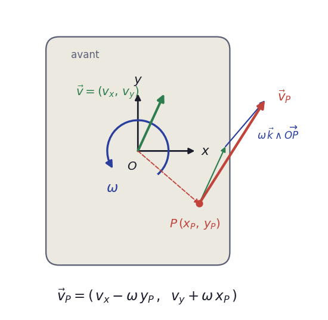
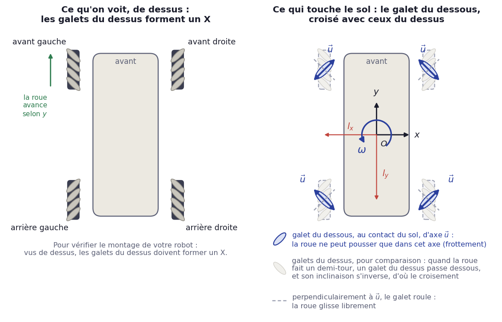
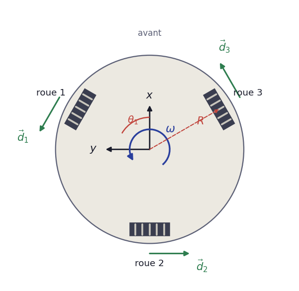

# Les moteurs : `holorobot.motors`

Chaque roue du robot est entraînée par un moteur **Dynamixel MX-12W**. Les moteurs sont chaînés sur un même câble, le **bus série** du robot (`/dev/serial0`), et chacun y a un numéro, son **identifiant** (ID). On commande les moteurs avec la bibliothèque pypot ; le module `holorobot.motors` la rend plus simple et ajoute une sécurité, le **chien de garde**.

```python
from holorobot.motors import Motors

with Motors() as motors:               # ouvre le bus, trouve les moteurs, les met en mode roue
    print(motors.ids)                  # par exemple [1, 2, 4, 8]
    motors.run({4: 90}, duration=2)    # le moteur 4 fait tourner sa roue à 90 °/s pendant 2 s
```

Le carnet **`decouverte_moteurs.ipynb`** (dossier `notebooks`) reprend tout ceci pas à pas, jusqu'au pilotage du robot.

## Notions

- **Identifiant (ID)** : chaque moteur répond à son numéro. Sur MobileRobot-1 : 4 avant gauche, 8 avant droite, 2 arrière gauche, 1 arrière droite. Sur un autre robot, les numéros peuvent être différents : on les découvre avec `find_ids()`.
- **Mode roue et mode articulation** : en **mode roue**, un Dynamixel tourne sans fin à la vitesse demandée : c'est celui qu'il faut pour des roues. En **mode articulation**, il va à une position et s'y tient, comme l'articulation d'un bras robotique : voir [Contrôle en position](#contrôle-en-position-mode-articulation). Le réglage est mémorisé par le moteur.
- **Vitesse** : en degrés par seconde (°/s). Une vitesse **positive** fait tourner la roue dans le sens inverse des aiguilles d'une montre, vue du côté de la roue. Comme les moteurs de gauche et de droite sont montés en miroir, une même vitesse positive fait avancer le robot d'un côté et le fait reculer de l'autre.
- **Vitesse maximale** : 720 °/s par défaut, soit 2 tours de roue par seconde. Une consigne plus forte est ramenée à cette limite, réglable avec `max_speed`.
- **Chien de garde** : si aucune consigne n'arrive pendant 0,5 s, toutes les roues s'arrêtent. Une consigne de `set_speeds()` ne vaut donc que 0,5 s. `run()` renvoie la consigne régulièrement ; dans vos propres boucles, renvoyez-la au moins 4 fois par seconde. C'est ce qui arrête le robot si votre programme plante ou si vous fermez le navigateur. Attention : le chien de garde vit dans votre programme ; si celui-ci est tué brutalement, les roues gardent leur dernière vitesse, et il faut couper l'alimentation.
- **Un seul programme à la fois** peut utiliser le bus : un second programme, ou un second objet `Motors()`, est refusé avec un message d'erreur. Dans un carnet, créez l'objet `Motors()` une seule fois et fermez-le à la fin (`motors.close()`) ; ou bien ouvrez-le le temps d'une cellule avec `with Motors() as motors:`, comme dans le tableau de bord. En cas de doute, redémarrez le noyau.

## Exemples

### Découvrir les moteurs

```python
from holorobot.motors import find_ids, status, voltages

print(find_ids())      # identifiants qui répondent, de 0 à 20 : par exemple [1, 2, 4, 8]
print(voltages())      # tension de la batterie lue par chaque moteur, sans rien changer aux moteurs
print(status())        # état de chaque moteur (mode, position, température…), sans rien lui changer
```

### Initialiser

```python
from holorobot.motors import Motors

motors = Motors()                      # trouve les moteurs et les met en mode roue
print(motors.ids, motors.models)       # [1, 2, 4, 8] {1: 'MX-12', 2: 'MX-12', ...}
print(motors.is_wheel_mode())          # True
print(motors.get_voltages())           # tension de la batterie, lue par chaque moteur
```

`Motors(wheel_mode=False)` ne touche pas au mode ; `motors.set_wheel_mode()` le règle ensuite.

### Faire tourner une roue

```python
motors.run({4: 90}, duration=2)        # 90 °/s pendant 2 s, puis arrêt
```

### Faire tourner plusieurs roues en même temps

```python
motors.run({1: 90, 2: 90, 4: 90, 8: 90}, duration=2)
```

Toutes les vitesses sont positives : les roues de gauche avancent et celles de droite reculent, donc le robot tourne sur lui-même.

### Commander en continu

```python
import time

end = time.monotonic() + 3
while time.monotonic() < end:
    motors.set_speeds({4: 60, 8: -60})  # à renvoyer souvent : le chien de garde veille
    time.sleep(0.05)
motors.stop()
```

### Contrôle en position (mode articulation)

Pour le projet, les moteurs servent de roues, mais un Dynamixel sait aussi aller à une position et s'y tenir. Avec la découpeuse laser ou l'imprimante 3D, deux moteurs en mode articulation font par exemple une **tourelle pan-tilt** pour la caméra : l'un la tourne à gauche et à droite (*pan*), l'autre vers le haut et le bas (*tilt*).

```python
motors.set_joint_mode([4], speed=60)        # mode articulation, mouvements à 60 °/s
motors.move_to({4: 90})                     # va à +90° et attend d'y être
motors.move_to({4: -45}, speed=120)         # plus vite
motors.set_positions({4: 0})                # rend la main tout de suite : le moteur y va seul
motors.set_wheel_mode([4])                  # retour au mode roue, à l'arrêt
```

- Les positions vont de −180° à 180°, 0 au milieu de la course.
- Une fois arrivé, le moteur **tient sa position** : il résiste si on le tourne à la main. Le chien de garde ne le concerne pas.
- Le changement de mode se fait sans à-coup : le moteur garde sa position en passant en mode articulation, et repart à l'arrêt en revenant au mode roue.
- Les mouvements se font à 6 °/s au moins : pour un Dynamixel en mode articulation, une vitesse de 0 veut dire « aussi vite que possible », et le MX-12W arrondit à 0 tout ce qui est plus lent que 5,5 °/s. La bibliothèque refuse ces vitesses.

### Fermer

```python
motors.close()                         # arrête les roues, coupe le couple, libère le bus
```

## Référence

### `find_ids(ids=range(21), port="/dev/serial0", baudrate=57600)`

Renvoie la liste des identifiants qui répondent, sans rien faire bouger.

### `voltages(ids=None, port="/dev/serial0", baudrate=57600)`

Tension lue par chaque moteur, celle de la batterie : `{identifiant: volts}`. Sans `ids`, interroge tous les moteurs présents. Ne change rien aux moteurs, contrairement à un `Motors()` qu'on referme (qui coupe leur couple).

### `status(ids=None, port="/dev/serial0", baudrate=57600)`

État de chaque moteur, lu sans rien lui changer : `{identifiant: {nom: valeur}}`, avec `"model"`, `"mode"` (`"wheel"` ou `"joint"`), `"position"` (degrés), `"speed"` (°/s), `"load"` (% du couple maximal), `"temperature"` (°C) et `"voltage"` (V). Sans `ids`, interroge tous les moteurs présents.

### `Motors(ids=None, port="/dev/serial0", baudrate=57600, wheel_mode=True, watchdog=0.5, max_speed=720)`

Ouvre le bus et cherche les moteurs : ceux de `ids`, ou de 0 à 20. Lève une `RuntimeError` si aucun moteur ne répond (sont-ils alimentés ?) ou si le bus est déjà utilisé, par ce programme ou par un autre.

| Attribut | Contenu |
|---|---|
| `ids` | identifiants des moteurs trouvés |
| `models` | modèle de chaque moteur |
| `modes` | mode de chaque moteur : `"wheel"` (roue) ou `"joint"` (articulation) |
| `watchdog` | délai du chien de garde, en s |
| `max_speed` | vitesse maximale autorisée, en °/s |
| `watchdog_stops` | nombre d'arrêts déclenchés par le chien de garde |

| Méthode | Effet |
|---|---|
| `is_wheel_mode()` | vrai si tous les moteurs sont en mode roue |
| `set_wheel_mode(ids=None)` | met les moteurs (tous, ou ceux de `ids`) en mode roue, à l'arrêt |
| `set_joint_mode(ids=None, speed=60)` | met les moteurs en mode articulation, sans qu'ils bougent ; `speed` en °/s, au moins 6 |
| `set_speeds({id: vitesse})` | vitesses en °/s, valables `watchdog` secondes ; les moteurs absents gardent leur consigne |
| `run({id: vitesse}, duration)` | fait tourner pendant `duration` s, puis arrête ; Ctrl-C ou *Interrupt Kernel* arrête aussi |
| `set_positions({id: angle}, speed=None)` | mode articulation : positions visées en degrés ; ne bloque pas |
| `move_to({id: angle}, speed=None, timeout=10, tolerance=3)` | comme `set_positions()`, mais attend que les moteurs soient arrivés (à `tolerance` degrés près) et arrêtés, puis renvoie les positions atteintes |
| `stop()` | arrête tout : les roues freinent (couple actif), les moteurs en mode articulation se tiennent là où ils sont |
| `release()` | arrête et coupe le couple : les moteurs tournent librement à la main |
| `get_speeds(ids=None)`, `get_positions(ids=None)` | vitesses (°/s) et positions (degrés, de −180 à 180) mesurées, de tous les moteurs ou de ceux de `ids` |
| `get_temperatures(ids=None)`, `get_voltages(ids=None)` | températures (°C) et tension d'alimentation (V) |
| `get_loads(ids=None)` | charge, en % du couple maximal : une roue qui force ou qui est bloquée |
| `change_id(ancien, nouveau)` | change l'identifiant d'un moteur, gardé en mémoire par le moteur ; le nouveau doit être libre, de 0 à 252 |
| `close(hold=False)` | arrête, coupe le couple et libère le bus ; avec `hold=True`, les moteurs gardent leur couple : les roues s'arrêtent en freinant, les moteurs en mode articulation gardent leur consigne et s'y tiennent |

`with Motors() as motors:` appelle `close()` en sortant, même en cas d'erreur.

## Piloter le robot

### Le repère du robot



Chaque robot est différent : chaque groupe conçoit le sien. On décrit son mouvement dans son propre repère, centré en $O$ : **x vers la droite**, **y vers l'avant**, l'avant choisi par le groupe. Un robot holonome peut se déplacer dans n'importe quelle direction tout en tournant : son mouvement à un instant donné est un **vecteur vitesse** $\vec v = (v_x, v_y)$, en m/s, et une **rotation instantanée** $\omega$, en rad/s, positive dans le sens inverse des aiguilles d'une montre vu de dessus.

Un point $P$ du robot, de coordonnées $(x_P, y_P)$, par exemple le centre d'une roue, a alors pour vitesse

$$\vec v_P = (\,v_x - \omega\,y_P\,,\; v_y + \omega\,x_P\,)$$

C'est le point de départ du calcul des vitesses des roues.

### Roues mecanum (base à 4 roues)



Une roue mecanum roule vers l'avant comme une roue ordinaire, mais sa jante porte des galets libres, inclinés à 45°. Ce qui compte, c'est le galet **au contact du sol**, d'axe $\vec u_i$ :

- **dans l'axe du galet**, selon $\vec u_i$, il ne peut pas rouler : il frotte sur le sol. C'est la seule direction dans laquelle la roue peut **pousser** le robot (force de traction, due au frottement) ;
- **perpendiculairement à $\vec u_i$**, le galet roule librement : la roue **glisse** sans résister.

Le galet qui touche le sol est celui **de l'autre côté de la roue**, en dessous. Vu de dessus, il est croisé avec les galets du dessus, ceux qu'on voit : quand la roue fait un demi-tour, un galet du dessus passe dessous et son inclinaison s'inverse (schéma de droite : galet du dessous en bleu, galets du dessus en gris clair). Pour que le robot tourne bien sur lui-même, les galets **du dessus** doivent dessiner un **X** vu de dessus (schéma de gauche) : vérifiez-le sur votre robot.

**La condition de roulement.** Le point du galet qui touche le sol ne doit pas glisser dans l'axe du galet. Sa vitesse par rapport au sol est la somme de la vitesse du centre de la roue, $\vec v_{P_i}$, de l'effet de la rotation de la roue (quand elle tourne vers l'avant à $\omega_i$, le bas de la roue recule de $r\,\omega_i$ : $-r\,\omega_i\,\vec y$), et de l'effet de la rotation du galet sur son axe, qui peut valoir n'importe quoi mais est toujours perpendiculaire à $\vec u_i$. Ce dernier terme absorbe tout ce qui est perpendiculaire à $\vec u_i$ ; selon $\vec u_i$, rien ne compense, d'où :

$$(\vec v_{P_i} - r\,\omega_i\,\vec y)\cdot \vec u_i = 0 \quad\Longrightarrow\quad \omega_i = \frac{\vec v_{P_i}\cdot\vec u_i}{r\,(\vec y\cdot\vec u_i)}$$

Les roues sont en $(\pm l_x, \pm l_y)$ : $l_x$ est la demi-distance entre les roues gauche et droite, $l_y$ celle entre les axes avant et arrière. Le développement roue par roue est fait dans le carnet.

### Roues holonomes (base à 3 roues)



Une roue holonome porte sur sa jante des galets libres dont l'axe suit la jante. Même principe que la roue mecanum : elle **pousse** dans l'axe de son galet au contact du sol, c'est-à-dire dans la direction où elle roule, $\vec d_i$, et elle **glisse** librement perpendiculairement, dans la direction de son axe. Seule compte donc la composante de $\vec v_{P_i}$ selon $\vec d_i$, ce qui donne la vitesse de rotation de la roue de rayon $r$ :

$$\omega_i = \frac{\vec d_i \cdot \vec v_{P_i}}{r}$$

Avec les roues placées à la distance $R$ du centre, à l'angle $\theta_i$ compté depuis l'axe $x$ (sur le schéma : 30°, 150° et 270°), et qui roulent tangentiellement, $\vec d_i = (-\sin\theta_i, \cos\theta_i)$. Développer ce calcul pour chaque roue, c'est l'objet du carnet.

### De la vitesse de la roue à la consigne du moteur

Les formules donnent $\omega_i$ en rad/s, positive quand la roue fait avancer le robot (ou le pousse selon $\vec d_i$). Pour le moteur, il faut :

1. convertir en °/s : `np.degrees(omega_i)` ;
2. multiplier par le **sens** du moteur, +1 ou −1, selon le côté où il est monté ;
3. l'envoyer à l'identifiant de la roue : `motors.set_speeds({id: vitesse})`.

Le carnet vous fait trouver les identifiants et les sens de votre robot, puis écrire la fonction de pilotage.

## Pièges courants

- **Radians ou degrés** : les formules sont en rad/s, les moteurs en °/s.
- **Le sens de chaque moteur** dépend de son montage : vérifiez-le roue par roue, robot sur une cale.
- **Galets en O au lieu de X** : si, vus de dessus, les galets du dessus dessinent un losange, le robot avance et recule normalement, mais part du mauvais côté et tourne mal, car ses roues poussent presque vers son centre. Échangez les roues avant et arrière de chaque côté.
- **Glissement** : sur un sol lisse, les roues mecanum patinent un peu ; le robot ne suit pas exactement la consigne. C'est normal, et c'est pour cela qu'il faut des capteurs (lidar, caméra) pour savoir où l'on est vraiment.
- **Chien de garde** : si les roues s'arrêtent toutes seules, votre boucle n'envoie pas la consigne assez souvent.
- **Une vitesse `nan`** (un calcul qui a mal tourné, une division par zéro) est refusée avec une erreur, au lieu de partir à fond.
- **Moteurs neufs** : un Dynamixel sort d'usine avec l'identifiant 1 et communique à 1 Mbit/s, alors que le bus du robot est réglé à 57 600 bauds. Il faut d'abord changer sa vitesse de communication, avec le logiciel *Dynamixel Wizard* de Robotis (demandez à l'enseignant), puis lui donner son propre identifiant (`change_id`), en branchant les moteurs neufs un par un.
